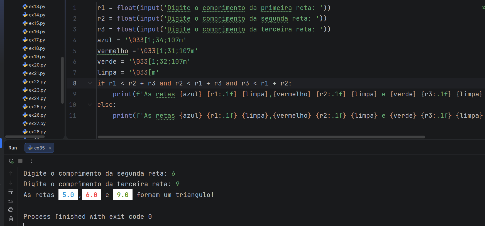

# 🐍 Desafios de Python - Mundo 1

Este repositório contém a resolução dos 35 primeiros desafios do primeiro mundo e suas continuações referente ao curso de **Python 3** do [Curso em Vídeo](https://www.cursoemvideo.com/), ministrado pelo professor Gustavo Guanabara.

## 🛠️ Conteúdo aplicado:
* **Fundamentos:** Instalação e primeiros comandos.
* **Tratamento de dados:** Tipos primitivos, entrada e saída de dados.
* **Aritmética:** Operadores, média, conversão de medidas e descontos.
* **Módulos:** Uso de bibliotecas para sorteios, arredondamentos e áudio.
* **Texto:** Manipulação de strings e análise de nomes.
* **Condições:** Estruturas de controle simples (`if/else`).

## 🚀 Próximo objetivo:
Concluir o Mundo 2 e dominar as estruturas de repetição (for/while).

### 🐍 Desafios do Mundo 1
* [x] [Desafio 01 - Olá Mundo](Mundo1/ex01.py)
* [x] [Desafio 02 - Respondendo ao Usuário](Mundo1/ex02.py)
* [x] [Desafio 03 - Somando dois números](Mundo1/ex03.py)
* [x] [Desafio 04 - Dissecando uma Variável](Mundo1/ex04.py)
* [x] [Desafio 05 - Antecessor e Sucessor](Mundo1/ex05.py)
* [x] [Desafio 06 - Dobro, Triplo, Raiz Quadrada](Mundo1/ex06.py)
* [x] [Desafio 07 - Média Aritmética](Mundo1/ex07.py)
* [x] [Desafio 08 - Conversor de Medidas](Mundo1/ex08.py)
* [x] [Desafio 09 - Tabuada](Mundo1/ex09.py)
* [x] [Desafio 10 - Conversor de Moedas](Mundo1/ex10.py)
* [x] [Desafio 11 - Pintando Parede](Mundo1/ex11.py)
* [x] [Desafio 12 - Calculando Descontos](Mundo1/ex12.py)
* [x] [Desafio 13 - Reajuste Salarial](Mundo1/ex13.py)
* [x] [Desafio 14 - Conversor de Temperaturas](Mundo1/ex14.py)
* [x] [Desafio 15 - Aluguel de Carros](Mundo1/ex15.py)
* [x] [Desafio 16 - Quebrando um número](Mundo1/ex16.py)
* [x] [Desafio 17 - Catetos e Hipotenusa](Mundo1/ex17.py)
* [x] [Desafio 18 - Seno, Cosseno e Tangente](Mundo1/ex18.py)
* [x] [Desafio 19 - Sorteando um item na lista](Mundo1/ex19.py)
* [x] [Desafio 20 - Sorteando uma ordem na lista](Mundo1/ex20.py)
* [x] [Desafio 21 - Tocando um MP3](Mundo1/ex21.py)
* [x] [Desafio 22 - Analisador de Textos](Mundo1/ex22.py)
* [x] [Desafio 23 - Separando dígitos de um número](Mundo1/ex23.py)
* [x] [Desafio 24 - Verificando as primeiras letras de um texto](Mundo1/ex24.py)
* [x] [Desafio 25 - Procurando uma string dentro de outra](Mundo1/ex25.py)
* [x] [Desafio 26 - Primeira e última ocorrência de uma string](Mundo1/ex26.py)
* [x] [Desafio 27 - Primeiro e último nome de uma pessoa](Mundo1/ex27.py)
* [x] [Desafio 28 - Jogo da Adivinhação v.1.0](Mundo1/ex28.py)
* [x] [Desafio 29 - Radar Eletrônico](Mundo1/ex29.py)
* [x] [Desafio 30 - Par ou Ímpar?](Mundo1/ex30.py)
* [x] [Desafio 31 - Custo da Viagem](Mundo1/ex31.py)
* [x] [Desafio 32 - Ano Bissexto](Mundo1/ex32.py)
* [x] [Desafio 33 - Maior e menor valores](Mundo1/ex33.py)
* [x] [Desafio 34 - Aumentos múltiplos](Mundo1/ex34.py)
* [x] [Desafio 35 - Tríangulos](Mundo1/ex35.py)

# 🐍 Jornada Python - Curso em Vídeo
## 🐍 Desafios do Mundo 2

Abaixo, os exercícios focados em condições alinhadas e estruturas de repetição:
* [x] [Desafio 36 - Aprovando Empréstimo](Mundo2/ex36.py)
* [x] [Desafio 37 - Conversor de Bases Numéricas (Binário, Octal e Hexadecimal)](Mundo2/ex37.py)

Em constante evolução, transformando lógica em autonomia!
